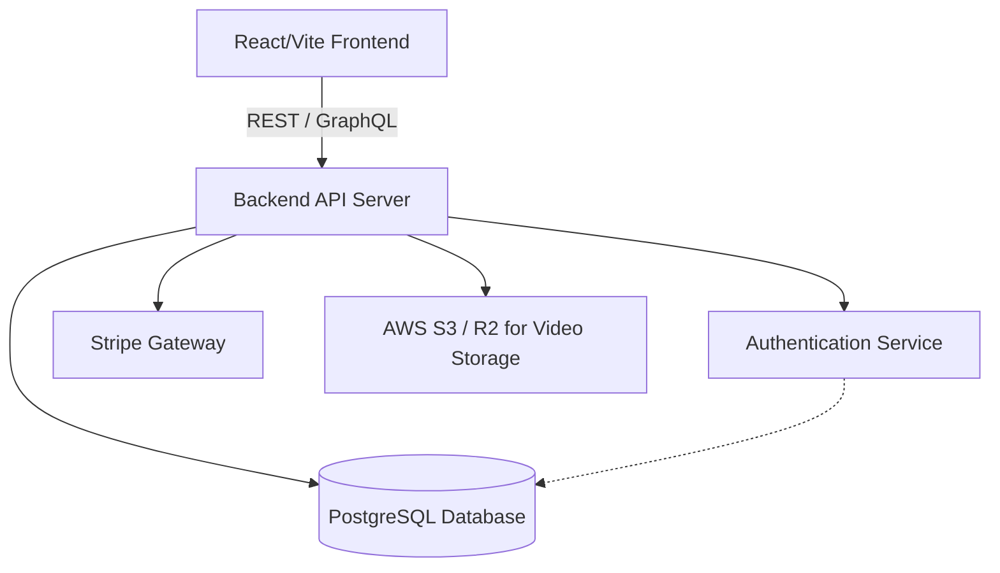

# Backend Architecture & Feature Proposals

Based on the current state of LearnHub (a frontend-heavy React/Vite application relying on static `fakeData.js` and local storage), introducing a backend will transform it into a fully functional, production-ready platform. 

Here is a comprehensive breakdown of what we can build on the backend for this project.

## 1. Core API & Database Integration
Currently, the app relies on `fakeData.js`. We should replace this with a dynamic database and a RESTful or GraphQL API.

- **Database**: Use PostgreSQL (relational, great for structured data like users and transactions) or MongoDB (flexible document storage for course content).
- **Course Catalog API**: Endpoints to fetch courses (`GET /api/courses`), support server-side pagination, filtering by category, and full-text search.
- **Content Management System (CMS)**: Secure endpoints (`POST /api/courses`, `PUT /api/courses/:id`) allowing instructors to create, edit, and delete courses, upload thumbnails, and manage curriculum.

## 2. Authentication & Authorization
Security and user identity are critical for an online learning platform.

- **User Authentication**: Implement JWT (JSON Web Tokens) or session-based authentication for user login and registration.
- **OAuth Providers**: Allow users to "Log in with Google" or "Log in with GitHub".
- **Role-Based Access Control (RBAC)**: Define roles:
  - `Student`: Can browse, purchase, and consume courses.
  - `Instructor`: Can create courses and view analytics on their sales.
  - `Admin`: Can manage users and platform settings.

## 3. Order Processing & Payments
The current cart system is purely visual and uses localStorage.

- **Stripe/PayPal Integration**: Connect the backend to a payment gateway to securely process credit card transactions.
- **Order History**: Store completed orders in the database (`User -> Orders -> Courses`).
- **Webhooks**: Listen for asynchronous payment confirmations from Stripe to automatically grant users access to their purchased courses.

## 4. Progress Tracking & State Management
Move user-specific state from the browser's `localStorage` to the secure backend.

- **Persistent Cart**: Save the cart to the database so if a user logs in on their phone, their cart is still there.
- **Enrollment System**: Track which courses a user is enrolled in.
- **Progress Tracking**: Record which video lectures the user has completed (`POST /api/progress/:courseId/:lessonId`).
- **Certificates**: Automatically generate and serve a PDF certificate when a user hits 100% completion.

## 5. Real-Time & Community Features
Enhance the "Community" and "Resources" sections.

- **Live Chat / Q&A**: Use WebSockets (e.g., Socket.io) to enable real-time chat between students and instructors during a live session.
- **Reviews & Ratings**: Allow students to leave reviews and calculate the aggregate rating dynamically on the server.
- **Push Notifications**: Notify students when an instructor uploads a new lecture or replies to their comment.

---

## Proposed Technology Stack

If we decide to build this, here are the best modern technology choices for the backend:

> [!TIP]
> **Recommended Stack**: **Node.js with Express or NestJS**
> Since the frontend is built with React/JavaScript, using Node.js allows us to keep the entire codebase in a single language (JavaScript/TypeScript), making full-stack development seamless.

## How to Proceed?

If you are ready to start building the backend, we can tackle it in phases:
1. **Phase 1**: Initialize a Node.js/Express server and connect a database.
2. **Phase 2**: Move `fakeData.js` into the database and create the Course API.
3. **Phase 3**: Implement User Authentication.
4. **Phase 4**: Implement the Checkout and Stripe integration.
